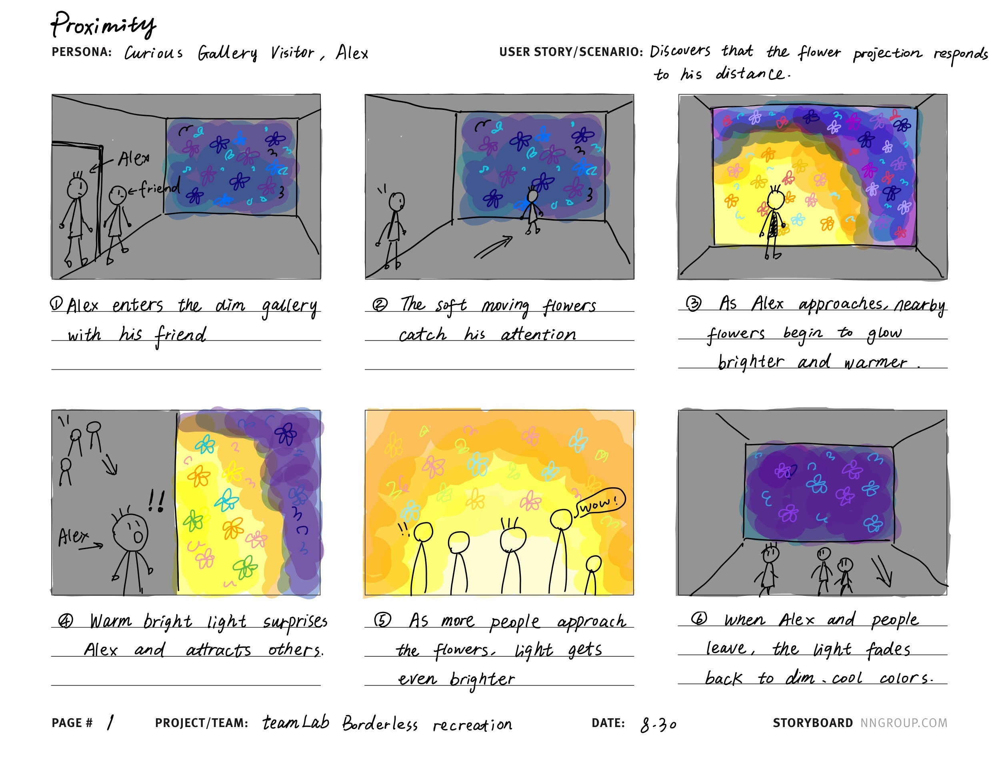
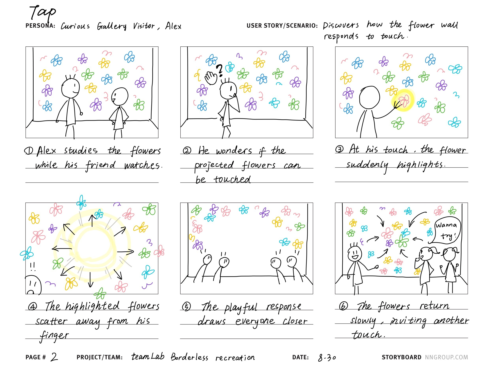
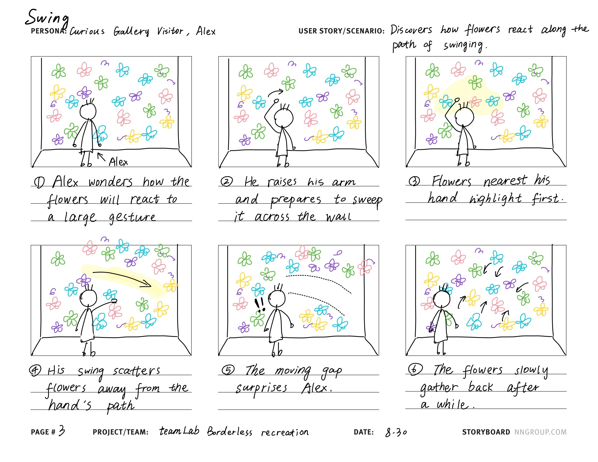

# Recreating the Masters of Interactive Light

**NAME OF BOTH COLLABORATOR(S) HERE:** Giorgi Samushia, Shuning Liu

**THE MASTERWORK YOU DREW FROM THE HAT:** teamLab Borderless (teamLab, 2018): "Light-flowers bloom and scatter on the surfaces you touch and pass."

---

# The Report

## Part 0. Know Your Master

teamLab Borderless is a digital art museum that opened in Odaiba, Tokyo in June 2018 (it moved to Azabudai Hills in 2024). It was made by teamLab, a Tokyo art collective founded in 2001 by Toshiyuki Inoko that mixes artists, programmers, engineers and architects. "Borderless" means the artworks have no frames: they spill out of their rooms, flow down corridors, and wander into each other.

Our card describes the flower works inside Borderless, mainly *Forest of Flowers and People: Lost, Immersed and Reborn* (2018). Flowers are projected across the walls and floor (and onto visitors' bodies), and they follow a life cycle: bud, bloom, wither, fade, over and over. Nothing is pre-recorded: the work is rendered in real time and changed by visitors' interaction, so previous states never come back.

**The interaction.** The flowers are never still: they bud, open, drift and breathe across the walls and floor on their own. Remaining still lets flowers bloom more abundantly around the visitor. In versions we observed online, touching the flowers causes petals to scatter around the visitor's hand and drift back as the field keeps going. This differs from teamLab's written description, which says touched flowers "wither and die all at once"; behavior can differ between installations, so we recreated what we could see. Flowers also scatter for reasons unrelated to the visitor, like when crows from a neighbouring artwork fly through, or when the waterfall next door swells.

**Inputs and responses.** The primary visitor inputs are presence, stillness, movement and touch. The flowers move continuously, bloom more where someone stays, and scatter away from a touch while the field keeps going. There is no way to make a flower on purpose, no way to keep one, and no way to stop the movement.

**Who is present.** The room is full of strangers, and the flowers are projected onto them too. One person's stillness can be undone by another person walking through. Other visitors become unplanned inputs into the same system, and the piece makes you aware of their bodies as part of the artwork.

**Strengths and weaknesses.** Strength: to us, its strength is that you feel immersed while understanding yourself not as the center of the piece but as a part of it. You warm it, scatter it, send a flower flying, and you remain one participant in a system that is bigger than you. Installation constraint: the immersive effect depends heavily on the dedicated dark environment and large-scale projection. We felt this directly: our recreation didn't work until the frame was nothing but flowers.

**The core interaction someone would recognize it by:** the flowers bloom and breathe everywhere, and your presence genuinely moves them, but the field is vast and was never about you. You affect it the way we affect nature: visibly, locally, and it persists beyond you. Walk away and it goes on.

## Part A. Plan

**Setting:** A dim indoor gallery with a colorful animated flower projection covering a wall.

**Players:** The primary player is a curious gallery visitor exploring the projection. A friend and other visitors are present nearby. They observe the interaction, react to the changing light, and may become interested in participating.

**Activity:** The player explores how distance, touch, and hand gestures affect the projected flowers. The light changes brightness and temperature accordingly, and this leads people to respond further emotionally and physically.

**Goals:** The player wants to discover how the projection responds to his body and gestures.

### Storyboard 1: Proximity

Flowers respond to the visitor's distance: as Alex approaches they glow brighter and warmer, the light gets even brighter as more people come close, and when everyone leaves it fades back to dim, cool colors.

### Storyboard 2: Tap

The wall responds to touch: the touched flower highlights and scatters away from the finger, the playful response draws everyone closer, and the flowers return slowly, inviting another touch.

### Storyboard 3: Swing

Flowers react along the path of a large gesture: those nearest the hand highlight first, the swing scatters them away leaving a moving gap, and they slowly gather back after a while.

**Feedback on the storyboards:** Most of the concept came from the two of us reading about the piece and watching videos of it, so the storyboards themselves didn't get much outside critique. The useful feedback arrived when we staged the prototype: early takes read as a laptop projecting on part of a wall. The projection didn't cover the frame and it looked a lot less immersive. We reframed the shot with Rati until the frame was nothing but flowers, and that single change is most of why the final video works.

## Part B. Act out the Interaction

Our acting out happened in two rounds: first physically testing the water-bottle idea with a phone and Tinkerbelle, and later rehearsing the scene against the real projection with a friend before recording.

**Are there things that seemed better on paper than when acted out?**

On paper we thought we could use Tinkerbelle as-is: put a water bottle on top of a phone and let it cast light around the room. We couldn't find a space dark and plain enough to make it work. Also, the effects couldn't happen at the point of interaction. The phone + bottle method gave us no accurate spot to display anything, so the light responded somewhere, just never where you touched.

**Did new ideas about the piece surface once you were on your feet?**

**Giorgi:** Not during the staging. The new idea came from watching the video we had staged. Seeing the field keep living after I walk out of frame gave me a new perspective on the interaction: nature is unchangeable and keeps being without us, even though we might affect it in significant ways for a while. Until then I had read the piece mostly through its immersive quality; this reframed it as being about our relationship with something that outlasts us.

**Are there key moments in the interaction where things could go in a different direction?**

At every point the visitor could just watch and not interact at all, or deliberately observe without disturbing the scene. And their interaction is not fully theirs: someone else entering the space can affect it, ripple through their patch, or flick a flower they were watching. Our video follows one path (approach, tap, flick, leave), but the piece holds all of these at once.

## Part C. Prototype the Light

We projected the Tinkerbelle light page onto the wall with a projector connected to the laptop, so the flowers appear at room scale on the surface the visitor touches. The wizard drives the light from the same laptop's keyboard, out of frame.

Out of the box, Tinkerbelle just turns the whole screen one flat colour that you pick from a colour picker. That could not read as Borderless, which is why the app in our video looks different. We changed the code quite a bit, and our fork is in the [`tinkerbelle`](tinkerbelle/) folder. We fixed a bug where fades finished almost instantly instead of taking their set time, and made colour fades travel through the in-between hues instead of through grey. Then we added a new mode for the light page that draws a field of about 300 flowers instead of a flat colour. Each flower takes its own shade of whatever colour the wizard picks, they all breathe and drift on their own, colour changes spread outward from the centre of the wall, and gesture keys make them ripple away from a tap or send one flying across the field. The wizard has keys for colours and keys for what the visitor's hand is doing:

| Key | What the light does | Meaning |
|---|---|---|
| L | 5 s fade to a dim violet-blue, flowers moving on their own | the resting field, nobody close |
| 1 | 6 s fade to emerald | idle drift, so the field visibly lives |
| A | 4 s fade to a warm rose, a little brighter | someone **walks up** to the flowers |
| Space | a ripple spreads out from the touch point: flowers are pushed outward, brighten, and drift back | visitor **taps** the wall |
| Enter | the flower nearest the touch point is sent flying across the wall, shoving the flowers it passes; everything drifts back | visitor **flicks** a flower |
| 0 | fade to black | off, end of the take |

The wizard watches the actor's hand and presses the matching key as the gesture happens; the flowers always drift back to where they were, so the field heals after every touch.

## Part D. Wizard the Device

Giorgi acted at the projected wall while our friend Rati sat at the laptop out of frame, watching Giorgi's hand directly and pressing the matching keys (approach, tap, flick, leave) as each gesture happened. In our first recording the projection covered only part of the frame, the browser's buttons were visible in the corner of the projection, and cables crossed the wall. For the final take we fullscreened the page, cleared the cables, and tightened the framing until only flowers were visible. The wizarding only read as real because Rati was keying off Giorgi's hand, not a script: the closer the light's response landed to the moment of the gesture, the more alive the wall felt.

[Rough first take](lab1-rough-take.mp4)

## Part E. (optional) Costume the Device

## Part F. Record

[Video sketch](lab1-video-sketch.mp4)

To illustrate the non-sequential side of the interaction, the take strings together different kinds of input rather than one repeated action: approaching, tapping, flicking, and just standing back. Between gestures the field keeps moving on its own, so the viewer can see that nothing forces the next step; the visitor could stop at any beat, do them in another order, or never touch the wall at all, and the flowers would go on either way.

## Reflections

Tinkerbelle out of the box can only turn a screen one flat colour, and a flat colour could not carry this piece. We ended up extending it a lot: fixing its fade timing, drawing a field of flowers on a canvas, and adding keys for what the visitor's hand is doing. It ate time the assignment maybe didn't ask for, but it forced us to decide which part of the interaction actually mattered, and that decision is the recreation.

**Giorgi:** My understanding of the piece also changed by making it. Going in, I had read Borderless mostly through its immersive quality. Watching our own staged footage, where the field keeps living after I walk out of frame, made the point land differently: we affect nature in significant ways for a bit, but it keeps being without us. I would not have gotten there by reading about it.

**Collaborators and credits:** Shuning Liu nailed down the core interaction from the research and videos, wrote the Part A plan, drew the storyboards, and brainstormed the recreation with Giorgi. Giorgi Samushia built the modified Tinkerbelle prototype, staged and acted the video, and put together this writeup. Rati Mukhuradze (friend) lent us the projector, helped stage the shot, and hand-wizarded the final take. Giorgi's roommate and family reacted to early ideas. Tinkerbelle tool by the IRL-CT lab. Research from teamLab's artwork page (teamlab.art/ew/flowerforest) and their official video of the work. Claude was used to help research the artwork and to debug and extend the Tinkerbelle code.

---

---

# Part 2 — ReMastering the light

*This describes the second week's work for this lab activity.*

## Prep (before the next lab)

Find three other groups. (How? Maybe Slack?) Visit their Lab Hub pages, watch their
videos, and give them reactions and feedback: tell them what you saw happening,
guess the masterwork and the goals of the characters, and ask about anything that
wasn't clear.

**Who were the other groups you kibitzed with? Add links to their project pages here.**
**Summarize the feedback you got from your partners here.**

## Remix, Update, or Critique the Master

Now that you understand your masterwork from the inside, respond to it. Do the
recreation again, but this time make it your own — pick one of these moves (or
combine them):

1. **Remix the modality.** Your recreation no longer has to (just) use light. Use
   vibration, sound, motion, heat — whatever best carries the interaction. Feel
   free to fork and modify the Tinkerbelle code. (Add your updates to this lab's folder!)
2. **Update it.** Redesign the piece for today's context, or for a setting its
   creators never imagined (the piece with roommates in the room, with children
   present, on a phone, in a car).
3. **Fix its weaknesses.** You identified this master's strengths and weaknesses
   in Part 0 — now address a weakness, or push a strength further.

We will grade this second pass with an emphasis on **creativity** and on how well
your response engages with what your master was really doing.

**Document everything here — especially the storyboard and video. Photos of the
prototype are great too.**

---

*Assignment lineage: this lab merges "Staging Interaction" (Interactive Lab Hub)
with "Recreating the Masters" (Interaction Design Studio, Profs. Scott Minneman &
Wendy Ju). Massive list of interactive light masterworks generated by Claude.ai.*
