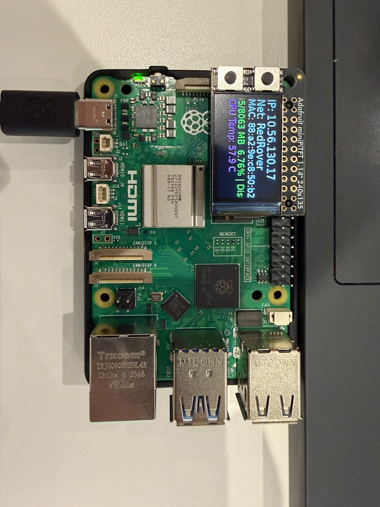
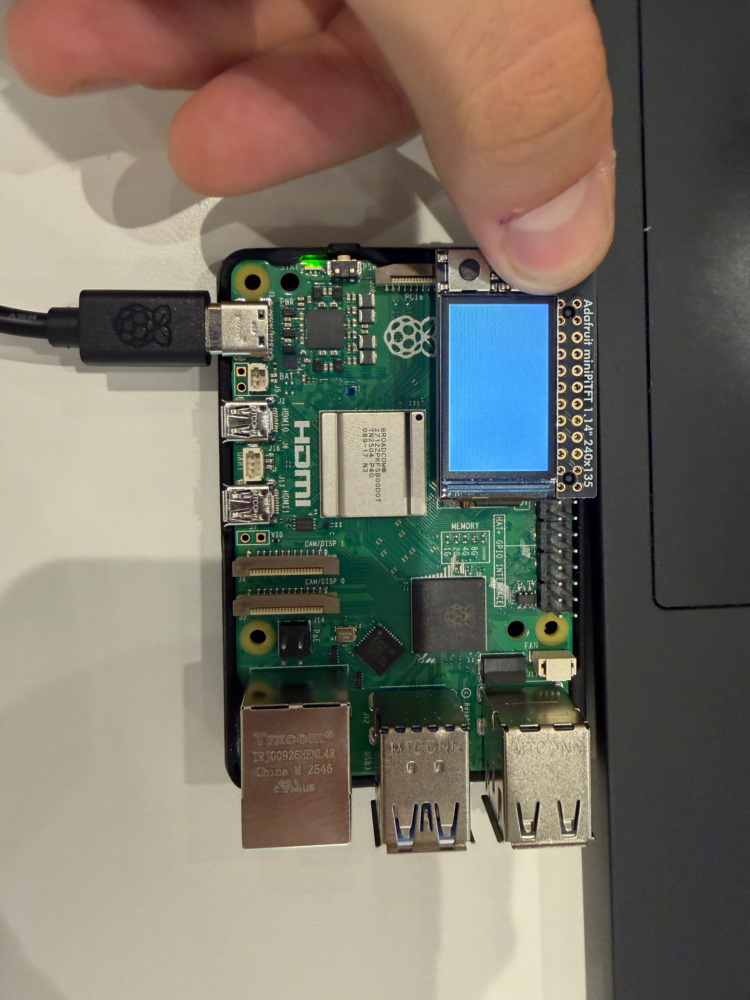
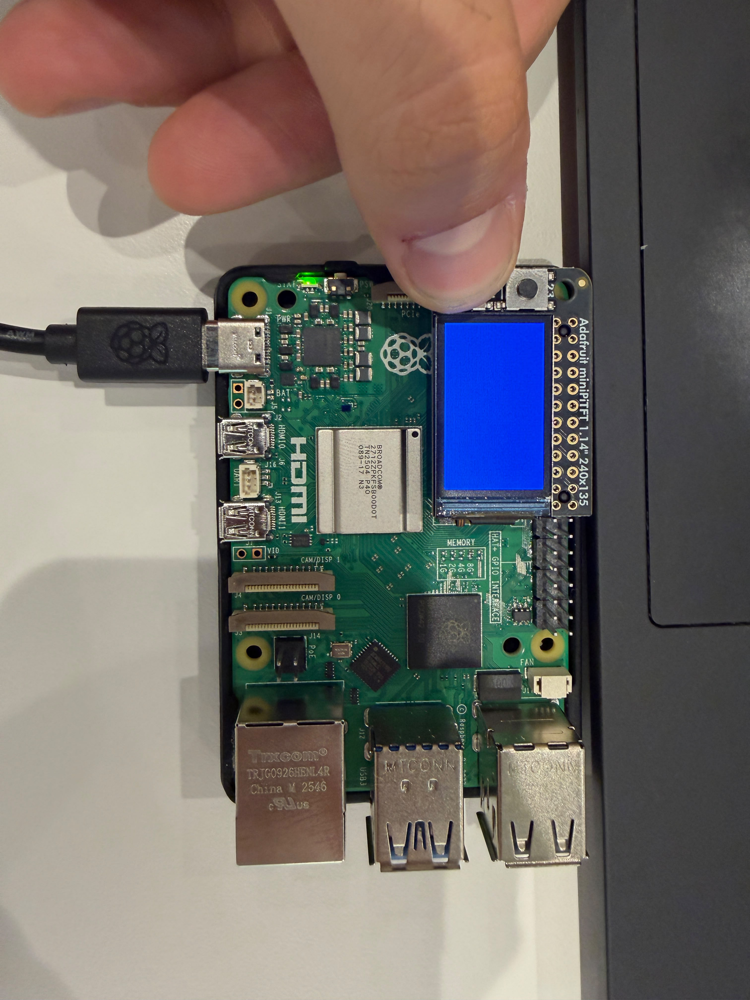
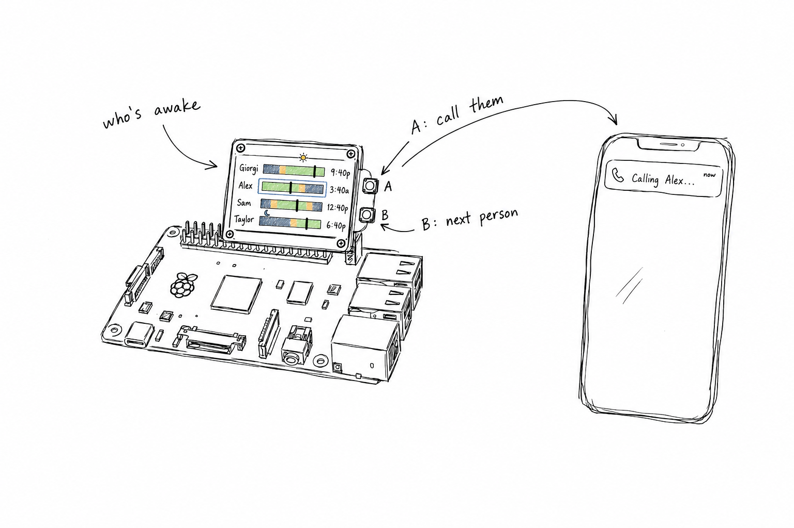
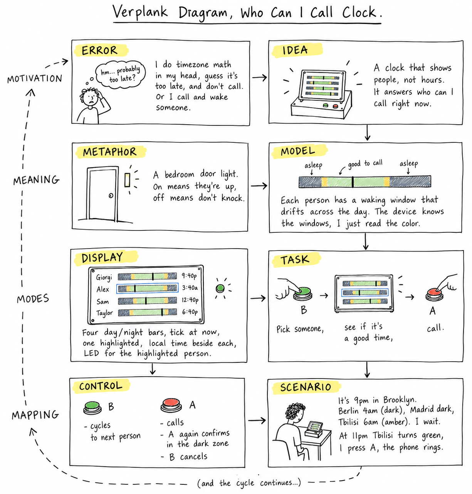

# Interactive Prototyping: The Clock of Pi
**Collaborator:** Shuning Liu

Does it feel like time is moving strangely during this semester?

For our first Pi project, we will pay homage to the [timekeeping devices of old](https://en.wikipedia.org/wiki/History_of_timekeeping_devices) by making simple clocks.

It is worth spending a little time thinking about how you mark time, and what would be useful in a clock of your own design.

**Please indicate anyone you collaborated with on this Lab here.**
Be generous in acknowledging their contributions! And also recognizing any other influences (e.g. from YouTube, Github, Twitter) that informed your design. 

## Prep

1. ### Set up your Lab 2 Github

At the start of lab Wednesday, ensure you have the latest lab content by updating your forked repository. 

**📖 [Follow the step-by-step guide for safely updating your fork](pull_updates/README.md)**

This guide covers how to pull updates without overwriting your completed work, handle merge conflicts, and recover if something goes wrong.


2. ### Get Kit and Inventory Parts
Take inventory of the kit parts that you have, and note anything that is missing:

***Update your [parts list inventory](partslist.md)***

3. ### Prepare your Pi for lab this week
[Follow these instructions](prep.md) to download and burn the image for your Raspberry Pi before lab Wednesday.


## Overview
For this assignment, you are going to 

A) [Connect to your Pi](#part-a)  

B) [Try out cli_clock.py](#part-b) 

C) [Set up your RGB display](#part-c)

D) [Try out clock_display_demo](#part-d) 

E) [Modify the code to make the display your own](#part-e)

F) [Make a short video of your modified barebones PiClock](#part-f)

G) [Sketch and brainstorm further interactions and features you would like for your clock for Part 2.](#part-g)

## The Report
This readme.md page in your own repository should be edited to include the work you have done. You can delete everything but the headers and the sections between the \*\*\***stars**\*\*\*. Write the answers to the questions under the starred sentences. Include any material that explains what you did in this lab hub folder, and link it in the readme.

Labs are due on Sunday midnight. Make sure this page is linked to on your main class hub page.

## Part A. 
### Connect to your Pi
Just like you did in the lab prep, ssh on to your pi. Once you get there, create a Python environment (named venv) by typing the following commands.

```
ssh pi@<your Pi's IP address>
...
pi@raspberrypi:~ $ python -m venv venv
pi@raspberrypi:~ $ source venv/bin/activate
(venv) pi@raspberrypi:~ $ 

```
### Setup Personal Access Tokens on GitHub
Set your git name and email so that commits appear under your name.
```
git config --global user.name "Your Name"
git config --global user.email "yourNetID@cornell.edu"
```

The support for password authentication of GitHub was removed on August 13, 2021. That is, in order to link and sync your own lab-hub repo with your Pi, you will have to set up a "Personal Access Tokens" to act as the password for your GitHub account on your Pi when using git command, such as `git clone` and `git push`.

Following the steps listed [here](https://docs.github.com/en/authentication/keeping-your-account-and-data-secure/managing-your-personal-access-tokens) from GitHub to set up a token. Depends on your preference, you can set up and select the scopes, or permissions, you would like to grant the token. This token will act as your GitHub password later when you use the terminal on your Pi to sync files with your lab-hub repo.


## Part B. 
### Try out the Command Line Clock
Clone your own lab-hub repo for this assignment to your Pi and change the directory to Lab 2 folder (remember to replace the following command line with your own GitHub ID):

```
(venv) pi@raspberrypi:~$ git clone https://github.com/<YOURGITID>/Interactive-Lab-Hub.git
(venv) pi@raspberrypi:~$ cd Interactive-Lab-Hub/Lab\ 2/
```
Depends on the setting, you might be asked to provide your GitHub user name and password. Remember to use the "Personal Access Tokens" you just set up as the password instead of your account one!

Check if the directory has clone sucessfully, you should see the Interactive-Lab-Hub under the home directory listed:
```
(venv) pi@raspberrypi:~ $ ls
Bookshelf      Documents            Music     Public                 venv
create_img.sh  Downloads            pi-apps   screen_boot_script.py  Videos
Desktop        Interactive-Lab-Hub  Pictures  Templates
(venv) pi@raspberrypi:~ $
```


Install the packages from the requirements.txt and run the example script `cli_clock.py`:

```
(venv) pi@raspberrypi:~/Interactive-Lab-Hub/Lab 2 $ pip install -r requirements.txt
(venv) pi@raspberrypi:~/Interactive-Lab-Hub/Lab 2 $ python cli_clock.py 
02/24/2021 11:20:49
```

The terminal should show the time, you can press `ctrl-c` to exit the script.
If you are unfamiliar with the Python code in `cli_clock.py`, have a look at [this Python refresher](https://hackernoon.com/intermediate-python-refresher-tutorial-project-ideas-and-tips-i28s320p). If you are still concerned, please reach out to the teaching staff!


## Part C. 
### Set up your RGB Display
We have asked you to equip the [Adafruit MiniPiTFT](https://www.adafruit.com/product/4393) on your Pi in the Lab 2 prep already. Here, we will introduce you to the MiniPiTFT and Python scripts on the Pi with more details.


The Raspberry Pi 5 has a variety of interfacing options. When you plug the pi in the red power LED turns on. Any time the SD card is accessed the green LED flashes. It has standard USB ports and HDMI ports. Less familiar it has a set of 20x2 pin headers that allow you to connect a various peripherals.


To learn more about any individual pin and what it is for go to [pinout.xyz](https://pinout.xyz/pinout/3v3_power) and click on the pin. Some terms may be unfamiliar but we will go over the relevant ones as they come up.

### Hardware (you have already done this in the prep)

From your kit take out the display and the [Raspberry Pi 5](https://www.google.com/url?sa=i&url=https%3A%2F%2Fwww.raspberrypi.com%2Fproducts%2Fraspberry-pi-5%2F&psig=AOvVaw330s4wIQWfHou2Vk3-0jUN&ust=1757611779758000&source=images&cd=vfe&opi=89978449&ved=0CBMQjRxqFwoTCPi1-5_czo8DFQAAAAAdAAAAABAE)

Line up the screen and press it on the headers. The hole in the screen should match up with the hole on the raspberry pi.

<p float="left">


</p>

### Testing your Screen

The display uses a communication protocol called [SPI](https://www.circuitbasics.com/basics-of-the-spi-communication-protocol/) to speak with the raspberry pi. We won't go in depth in this course over how SPI works. The port on the bottom of the display connects to the SDA and SCL pins used for the I2C communication protocol which we will cover later. GPIO (General Purpose Input/Output) pins 23 and 24 are connected to the two buttons on the left. GPIO 22 controls the display backlight.

To show you the IP and Mac address of the Pi to allow connecting remotely we created a service that launches a python script that runs on boot. For the following steps stop the service by typing ``` sudo systemctl stop piscreen.service --now```. Othwerise two scripts will try to use the screen at once. You may start it again by typing ``` sudo systemctl start piscreen.service --now```

We can test it by typing 
```
(venv) pi@raspberrypi:~/Interactive-Lab-Hub/Lab 2 $ python screen_test.py
```

You can type the name of a color then press either of the buttons on the MiniPiTFT to see what happens on the display! You can press `ctrl-c` to exit the script. Take a look at the code with
```
(venv) pi@raspberrypi:~/Interactive-Lab-Hub/Lab 2 $ cat screen_test.py
```

#### Displaying Info with Texts
You can look in `screen_boot_script.py` for how to display text on the screen!

#### Displaying an image

You can look in `image.py` for an example of how to display an image on the screen. Can you make it switch to another image when you push one of the buttons?

\*\*\***Include a picture of your own Raspberry Pi displaying the piscreen.service with your unique MAC address. Additionally, please provide another picture showing the successful completion of the screen test.**\*\*\*

piscreen.service on boot, showing the IP, network, and MAC:



screen_test.py: button A gives white, button B gives the colour I typed (blue):

<p float="left">


</p>


## Part D. 
### Set up the Display Clock Demo
Work on `screen_clock.py`, try to show the time by filling in the while loop (at the bottom of the script where we noted "TODO" for you). You can use the code in `cli_clock.py` and `stats.py` to figure this out.

### How to Edit Scripts on Pi
Option 1. One of the ways for you to edit scripts on Pi through terminal is using [`nano`](https://linuxize.com/post/how-to-use-nano-text-editor/) command. You can go into the `screen_clock.py` by typing the follow command line:
```
(venv) pi@raspberrypi:~/Interactive-Lab-Hub/Lab 2 $ nano screen_clock.py
```
You can make changes to the script this way, remember to save the changes by pressing `ctrl-o` and press enter again. You can press `ctrl-x` to exit the nano mode. There are more options listed down in the terminal you can use in nano.

Option 2. Another way for you to edit scripts is to use VNC on your laptop to remotely connect your Pi. Try to open the files directly like what you will do with your laptop and edit them. Since the default OS we have for you does not come up a python programmer, you will have to install one yourself otherwise you will have to edit the codes with text editor. [Thonny IDE](https://thonny.org/) is a good option for you to install, try run the following command lines in your Pi's ternimal:

  ```
  pi@raspberrypi:~ $ sudo apt install thonny
  pi@raspberrypi:~ $ sudo apt update && sudo apt upgrade -y
  ```

Now you should be able to edit python scripts with Thonny on your Pi.

Option 3. A nowadays often preferred method is to use Microsoft [VS code to remote connect to the Pi](https://www.raspberrypi.com/news/coding-on-raspberry-pi-remotely-with-visual-studio-code/). This gives you access to a fullly equipped and responsive code editor with terminal and file browser.  

Pro Tip: Using tools like [code-server](https://coder.com/docs/code-server/latest) you can even setup a VS Code coding environment hosted on your raspberry pi and code through a web browser on your tablet or smartphone! 

## Part E. Read Part 2. Sketch and brainstorm further interactions and features you would like for your clock.

One potential source of ideas might be thinking about other clocks and timekeeping devices for inspiration.

Another might be novel units of time. How do you measure a year? [In daylights? In midnights? In cups of coffee?](https://www.youtube.com/watch?v=wsj15wPpjLY)

We strongly discourage literal digital or analog clock display: Be creative.


** Insert ideas, sketches, [Verplank diagrams](https://ccrma.stanford.edu/courses/250a-fall-2004/IDSketchbok.pdf)), storyboards for your ideas **

This section was worked on with my lab partner, Shuning Liu, whose own Lab Hub is [here](https://github.com/SinaL0123/Interactive-Lab-Hub/tree/Fall2026/Lab%202). I used AI to help organize my ideas, for research, and to help produce the sketches below.

### Who Can I Call Clock

I am in New York, my family is in Tbilisi, my sister is in Berlin, and a friend is in Madrid. Instead of four separate clocks, the PiTFT shows four horizontal bars, one per person, each a 24-hour strip that runs dark where they are asleep and green where it is a fine time to call, with amber at the edges in between, a black tick mark for the current time, and their local time written beside the bar. One bar is highlighted at any moment. Button B cycles the highlighted person forward through the four. Button A calls whoever is highlighted, sending a notification to my phone that places the call. If I press A while that person is in their dark zone, the screen does not just call, it asks first, something like "3:40 AM in Tbilisi. Call anyway?", and a second press of A goes through while B cancels back to the normal view. The Qwiic buttons' own LEDs double as a quick status check, green when the highlighted person is callable, red when they are not, so I do not even need to read the screen to know. Berlin and Madrid happen to share a timezone, which is part of the point, the unit here is people, not hours. Parts: the PiTFT, both Qwiic buttons, and my phone for the call step.





### Candle Clock (Sina)

My idea is to create a candle clock that represents time through candles burning. I chose candles because burning and melting show the passage of time in a natural way. On the default screen, there will be twelve candles, and each candle represents two hours. Past candles are melted, the current candle is burning, and future candles are still unlit.

The two buttons allow the user to see different information. Pressing A shows a zoom-in view of the current candle. Pressing B opens the focus page, and holding B starts or ends a focus session. The focus timer will continue running even when the user switches to another screen. A small blue flame will indicate that focus mode is active. Pressing A and B together opens a memory page where each completed focus session becomes a wax seal. One seal represents one session, and its size represents the duration.

I first thought about using the melted wax to create a different image each day, which led me to the idea of using wax seals as records of focused time. I am still not sure how detailed the candle animation and wax seals can be on the small Raspberry Pi screen, or how much information can fit clearly. I may need to simplify the graphics after testing the display and buttons.


**Put the names of the people you gave feedback to here. (Even better, add links to their repos here!)**

* David Zhang: https://github.com/davidzhanggg/Interactive-Lab-Hub/tree/Fall2026/Lab%202

* Jindi Chai: https://github.com/JindiChai/Interactive-Lab-Hub/blob/Fall2026/Lab%202

* Amy Gao: https://github.com/zg375/Interactive-Lab-Hub/tree/86dc14dd4b592afbeb4f4187617a6ae88da5ad3f/Lab%202

# Lab 2 Part 2

## Prep 

1. Pick up remaining parts for kit on Wednesday lab class. Check the updated [parts list inventory](partslist.md) and let the TA know if there is any part missing.

2. Look at and give feedback on the Part E. for at least 3 other people in the class and get 3 people to comment on your Part E!)
**Put the feedback for your ideas here.**

David, Jindi, and Amy reviewed our shared Part E, which covers both ideas below.

***David:*** I like the concept of using candles to represent the times. The storyboard is very visually appealing and provides alot of helpful information. The colors and highlights allow readers to easily figure out what is happening in the interaction. One improvement that could be worked on is maybe more explanation on the wax seals. The wax seals size representing how long the study session / focus is very vague and doesn't tell much information. It would be helpful to know how much represents what, maybe with colors instead. For the two ideas, I personally more into the first one because is more related to the clock idea, the other is more complex and cool but looks more like a communication tool.

***Jindi:*** Candle Clock

I really like how you use burning and melting candles as a metaphor for the passage of time. I also think the focus mode is very useful. Using visual elements like wax seals instead of just text to record focus sessions makes it easier for users to see their progress, and I think it can also give them a stronger sense of accomplishment.

One small question I have is about the screen display. Since one candle represents two hours, there will be 12 candles on the screen. Would they be too small or make the screen feel crowded? Also, when there are more and more wax seals and they no longer fit on one screen, how would they be displayed? Would they be organized by time period, or could users switch between pages?

Who Can I Call Clock

I think this project does a really nice job of combining time zones, family, and communication. It is very practical, but also has a warm and personal feeling, which reminds me of my own family and friends. Because we are in different time zones, they sometimes hesitate to call me because they don't know if I'm sleeping or in class. If everyone had a similar "clock," I think it could help a lot with this problem.

I also like the use of bars and different colors to show people's status and whether they are available to call. Being able to call someone directly with a button is also very convenient because you don't need to spend time finding them in your contacts.
One thing I'm curious about is how the different time blocks are decided. How do we know when it is a "good time to call" for each person? If someone is awake but is working or in class, would that also be reflected on the display? Also, would users manually set their usual available times, or could the clock get this information automatically from their calendar or other sources?

***Amy:*** I really like how the candle metaphor extends into the wax seals for focus memories. My main suggestion would be to test whether the different button controls are easy to remember, since A, B, holding B, and A+B all have different functions. Simplifying some of the interactions might make the overall experience more intuitive.

***My takeaway on the Who Can I Call Clock:*** David is right that it is more of a communication tool than a clock, and adding a real Twilio call made that more true, not less. I am fine with that. The clock part is what makes the call button worth pressing, because the whole point was that the unit is people, not hours. On Jindi's question, the awake and asleep hours are hardcoded per person. That was a deliberate shortcut to get the display and the call flow working, but it is the weakest part of the design. My sister's schedule is not the same every day, so the next step would be a manual override first, and calendar or status data after that if it turns out to be worth the setup.

## Update your Lab Hub

[Update your Lab Hub](pull_updates/README.md) to get the latest content and requirements for Part 2.

## Modify the barebones clock to make it your own

Start small, pick just one element of your overall idea, just to show you have a handle on the code and components.

\*\*\***Put a copy of your code in your Lab 2 Github repo.**\*\*\*

One small addition on top of the barebones clock: a row of 12 candles, drawn as plain rectangles (one per 2-hour block of the day), that shrinks as the current block burns down. [`piclock_modified.py`](piclock_modified.py)

## Make a short video of your modified barebones PiClock

https://github.com/user-attachments/assets/9c5168b4-784c-475d-bb27-4446f6f01775

\*\*\***Take a video of your barely modified PiClock.**\*\*\*

After you edit and work on the scripts for Lab 2, the files should be upload back to your own GitHub repo! You can push to your personal github repo by adding the files here, commiting and pushing.

```
(venv) pi@raspberrypi:~/Interactive-Lab-Hub/Lab 2 $ git add .
(venv) pi@raspberrypi:~/Interactive-Lab-Hub/Lab 2 $ git commit -m 'your commit message here'
(venv) pi@raspberrypi:~/Interactive-Lab-Hub/Lab 2 $ git push
```

After that, Git will ask you to login to your GitHub account to push the updates online, you will be asked to provide your GitHub user name and password. Remember to use the "Personal Access Tokens" you set up in Part A as the password instead of your account one! Go on your GitHub repo with your laptop, you should be able to see the updated files from your Pi!

## Now, make your own PiClock

Do take advantage of having done the previous iteration to refine and simplify your design.

** Insert any updates ideas, sketches, [Verplank diagrams](https://ccrma.stanford.edu/courses/250a-fall-2004/IDSketchbok.pdf))!, storyboards for your ideas **

Built the Who Can I Call Clock from the Part E concept: four horizontal 24-hour bars (one per contact), green/amber/dark to show whether it's a good time to call, a white tick for their current local time via `zoneinfo` (handles DST automatically). Button B cycles the highlighted contact; button A calls them if they're in the green window, or opens a confirm prompt first if not. Calling is a real bridged phone call (Twilio Voice: it dials the contact, and once they pick up, dials my own phone and connects us) rather than a simulated/on-screen-only call.

My lab partner is Shuning Liu, whose own Lab Hub for the Candle Clock is [here](https://github.com/SinaL0123/Interactive-Lab-Hub/tree/Fall2026/Lab%202). (Still deciding with her whether our final repos end up structured the same way or stay separate.)

\*\*\***Put a copy of your code in your Lab 2 Github repo.**\*\*\*

[`who_can_i_call_clock.py`](who_can_i_call_clock.py). Its companion `who_can_i_call_config.py` (Twilio credentials, contacts' phone numbers/timezones) is intentionally gitignored and not committed, since it holds real API credentials.

\*\*\***Take a video of your PiClock.**\*\*\*

https://github.com/user-attachments/assets/4fc4d7d3-3e2b-4d4f-bf9a-43ff75c2adc7

I used Claude to write some of the code and to guide me through Twilio setup, since I ran into several account/trial restriction complications getting real calling to work.

As always, make sure you document contributions and ideas from others (and AI) explicitly in your writeup.

You are permitted (but not required) to work in groups and share a turn in; you are expected to make equal contribution on any group work you do, and N people's group project should look like N times the work of a single person's lab.  Make sure the page for the group turn in is linked to your personal Interactive Lab Hub page. 


