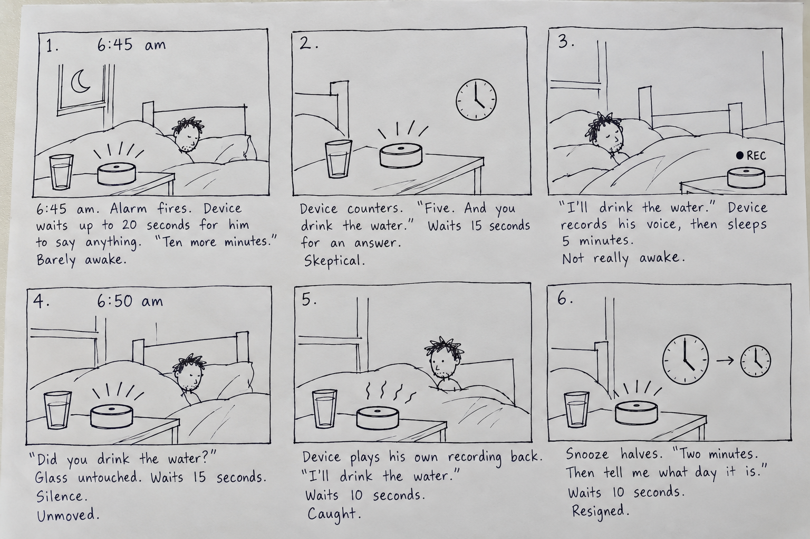

# Chatterboxes

**Collaborators:** none, I did this lab alone.

A speech-enabled bedside alarm that never grants a snooze outright. It counters with less time plus one small task, records my promise, and plays it back to me if I do not follow through. Storyboard and script are in Part D.

---

# Part 1

## A. Text to Speech

I tried all three engines on the same greeting. My greeting script uses Piper: [`speech-scripts/greet_samu.sh`](speech-scripts/greet_samu.sh). It says "Hello Samu" rather than "Hello Giorgi" because Piper pronounces Giorgi as "Jorgee".

- **espeak-ng:** very robotic and close to hard to understand. I could follow it, but I had to concentrate the whole time it was talking.
- **festival:** also robotic and sounds similar to espeak, though not the same. The voice is deeper and a little easier to understand.
- **Piper:** sounds the most like a real person and is by far the easiest to understand. The cadence is a little off, so you can tell it is not human, but it sounds good.

**Is the same greeting, in these different voices, the same greeting?**

No, it was not the same greeting. The words did not change, but who was saying them did. With espeak and festival it felt like a computer reading a sentence out loud, so "welcome back" was just information. Piper still sounded synthetic, but it was close enough to a person saying it to me that the same words felt like an actual greeting instead of a message.

## B. Speech to Text

Class recording, `lookdave.wav` (3.72s). All three sizes transcribed it correctly.

| model | transcription | real-time factor |
|---|---|---|
| tiny.en | 1.09s | 0.29x |
| base.en | 2.03s | 0.55x |
| small.en | 6.07s | 1.63x |

My own recording, 10 seconds, saying "Hi I am Samu, my favourite numbers are 1 2 3 5 8 13 21 34".

| model | transcription | real-time factor | transcript |
|---|---|---|---|
| tiny.en | 1.47s | 0.15x | Hi, I am some my favorite numbers are 1, 2, 3, 5, 8, 13, 21, 34. |
| base.en | 2.55s | 0.26x | Hi, I am Samu. My favorite numbers are 1, 2, 3, 5, 8, 13, 21, 34. |
| small.en | 7.93s | 0.79x | Hi, I am Samu. My favorite numbers are 1, 2, 3, 5, 8, 13, 21, 34. |

**At what point does the accuracy improvement stop being worth the delay, for a system that has to answer you?**

For me the line is at base.en. Going from tiny to base cost about one extra second on a ten second clip and fixed the only mistake, which was my name. Going from base to small cost another five seconds and fixed nothing. For a device that has to answer me, a one second wait feels like it is thinking, but a wait longer than what I said feels broken, and small.en was already close to that on the class recording, where it ran slower than real time.

**Script that verbally asks for a numerical input and records the answer:** [`speech-scripts/ask_number.py`](speech-scripts/ask_number.py). Piper asks the question, Silero VAD decides when the answer has ended, faster-whisper (base.en) transcribes it, and the device reads the digits back. The raw audio and transcript are saved so the digit errors can be inspected. The endpointing silence is set to 1.0s instead of the class default of 0.4s, because people say numbers in groups with longer pauses between the groups.

Three runs:

| question | I said | heard | digits |
|---|---|---|---|
| zip code | one one two three four | `One, one, two, three, four.` | none |
| zip code | one two three four five | `1, 2, 3, 4, 5.` | 12345 |
| phone number | 917 550 7533, in groups | `917 550 753 3` | 9175507533 |

Two characteristic errors showed up. In the first run whisper wrote the digits as words, so the digit filter found nothing, and the same words came back as digits on the next run. In the phone number run every digit was right but the grouping was not, so a device reading it back would sound wrong while being right.

## C. Turn-taking

**At 0.2s, what kinds of normal speech get cut off? At 1.5s, what does the delay make the system seem like?**

At 0.2 seconds it felt like I had to get everything out fast. Any normal pause to think was treated as the end of my turn, so I was being cut off mid idea. "I want to order... the dumplings" came back as two separate turns:

```
[1.3s speech, 0.95s to transcribe]  I want to order...
[0.8s speech, 0.85s to transcribe]  the dumplings.
```

At 1.5 seconds it worked, but it felt a little dragged out. I pause a lot when I talk, so it never cut me off, but the wait after I finished was long enough to notice.

The default 0.4 seconds felt smooth. It never cut me off and it did not leave me waiting either, so this is the one that felt most like talking to something that was listening.

Echo bot at the default 0.4s:

```
  heard: I need to get bread.
  reply: You said: I need to get bread.
  [asr 0.89s | tts first audio 0.28s | total gap 1.17s]
```

## D. Storyboard

### The Negotiating Alarm



The storyboard covers scenes 1 and 2 of the script below. Scenes 3 and 4 are the rest of the ladder, and scene 5 is design only.

**Process**

I commute to school and need to be there by 8:30, and I struggle with it every morning, so I wanted an alarm that fights back. I started by listing devices that would be funny to argue with and picked this one. My first version either allowed the snooze or refused it, which ends after one exchange. Having it counter-offer instead, less time plus one small task, gave it a reason to come back with a second question, and that second question is really the alarm. The ladder came from asking what happens if I just fall asleep again: each round halves the snooze and shortens the wait, and silence counts as a no. I also thought about having it text a family member to judge my excuse, and a mode where it narrates me not moving, but both need another person or voice, so they stayed as notes. Drawing the storyboard moved one thing. I had the device replaying my recorded promise late in the ladder, but in the panels it was clearly the moment that makes the idea work, so it became the first thing the device does when I go quiet.

**Dialogue script**

```
THE NEGOTIATING ALARM
Dialogue script, CS 5424 Lab 3 Part 1

Legend
[wait Ns]    device listens for up to N seconds, timed from the moment it stops speaking.
[sleep N]    device is silent and not listening for N.
[sensor]     the sensor decides whether a task was done. The question the device asks is what it says about it, not how it finds out. Water: glass lifted off a copper tape pad. Hand: palm on the capacitive pad on top of the device.
[off button] a physical red button. Stops everything at any point.

Rules
Answers the device understands: yes (yes, fine, ok, sure), no, a number of minutes, a day of the week.
Silence, mumbling, or anything it cannot map moves one rung down. It never stands still, whether it was a check or an offer.
Ladder: opening wait 20s. Then 5 min / 15s wait, 2 min / 10s, 1 min / 5s, then 30s grace with no question, then the alarm at full volume. Ten minutes is what I ask for, never what I get.
Times are rounded to the minute. Storyboard covers scenes 1 and 2. Scene 5 is design only, not in the Part 2 build.

SCENE 1, 6:45 AM, dark room

DEVICE:  It's 6:45.
         [wait 20s]
G:       Ten more minutes.
DEVICE:  Five. And you drink the water.
         [wait 15s]
G:       Fine.
DEVICE:  Say it.
         [wait 15s]
G:       I'll drink the water.
DEVICE:  Recorded. Five minutes.
         [sleep 5 min]

SCENE 2, 6:50 AM

DEVICE:  [sensor: glass still on the pad]
         Did you drink the water?
         [wait 15s]
G:       (nothing)
DEVICE:  [plays G's own voice] "I'll drink the water."
         [wait 10s]
G:       (mumbles)
DEVICE:  I didn't get that. Two minutes. Then you tell me what day it is.
         [wait 10s]
G:       Ok.
DEVICE:  Two minutes.
         [sleep 2 min]

SCENE 2 ALT, the happy path

DEVICE:  [sensor: glass lifted during the sleep]
         You drank the water. Good morning.
         [off]

SCENE 3, 6:53 AM

DEVICE:  What day is it?
         [wait 10s]
G:       Monday.
DEVICE:  It's Sunday. One minute. Then your hand on the device.
         [wait 5s]
G:       Ok.
DEVICE:  One minute.
         [sleep 1 min]

SCENE 3 ALT, the happy path

G:       Sunday.
DEVICE:  You're awake. Good morning.
         [off]

SCENE 4, 6:54 AM

DEVICE:  Hand on the device.
         [wait 5s, sensor: nothing]
         Thirty seconds.
         [sleep 30s]
         [alarm at full volume. No question. Stops only on sensor: hand on the device, or the off button.]

SCENE 5, 11:20 PM, same day (design only)

G:       Alarm for 6:45.
DEVICE:  6:45. You still owe me the water. That's first tomorrow.
         [off]
```

## E. Acting out the dialogue

**Recording:** to do.

**Describe if the dialogue seemed different than what you imagined when it was acted out, and how.**

To do.

---

The idea, the storyboard panels, the dialogue script, and all written answers are mine. The storyboard drawing was generated with AI from my panel descriptions. I used Claude to write the greeting and number-asking scripts and to proofread my writing.

---

# Lab 3 Part 2

For Part 2, you will redesign the interaction with the speech-enabled device using the data collected, as well as feedback from part 1.

## Prep for Part 2

1. What are concrete things that could use improvement in the design of your device? For example: wording, timing, anticipation of misunderstandings.
2. What are other modes of interaction *beyond speech* that you might also use to clarify how to interact? In particular: how does someone know when the device is listening, and when it is thinking? You have a screen and an LED.
3. Make a new storyboard, diagram and/or script based on these reflections.
4. (optional) Integrate [input devices](inputs.md) in the system

## Prototype your system

The system should:
* use the Raspberry Pi
* use one or more sensors
* require participants to speak to it

*Document how the system works.*

*Include videos or screencaptures of both the system and the controller.*

## Test the system

Try to get at least two people to interact with your system. (Ideally, you would inform them that there is a wizard *after* the interaction, but we recognize that can be hard.)

Answer the following:

### What worked well about the system and what didn't?
\*\**your answer here*\*\*

### What worked well about the controller and what didn't?
\*\**your answer here*\*\*

### What lessons can you take away from the WoZ interactions for designing a more autonomous version of the system?
\*\**your answer here*\*\*

### How could you use your system to create a dataset of interaction? What other sensing modalities would make sense to capture?
\*\**your answer here*\*\*

<details>
  <summary><strong>Submission Cleanup Reminder (Click to Expand)</strong></summary>

  **Before submitting your README.md:**
  - This readme.md file has a lot of extra text for guidance.
  - Remove all instructional text and example prompts from this file.
  - You may either delete these sections or use the toggle/hide feature in VS Code to collapse them for a cleaner look.
  - Your final submission should be neat, focused on your own work, and easy to read for grading.
</details>
